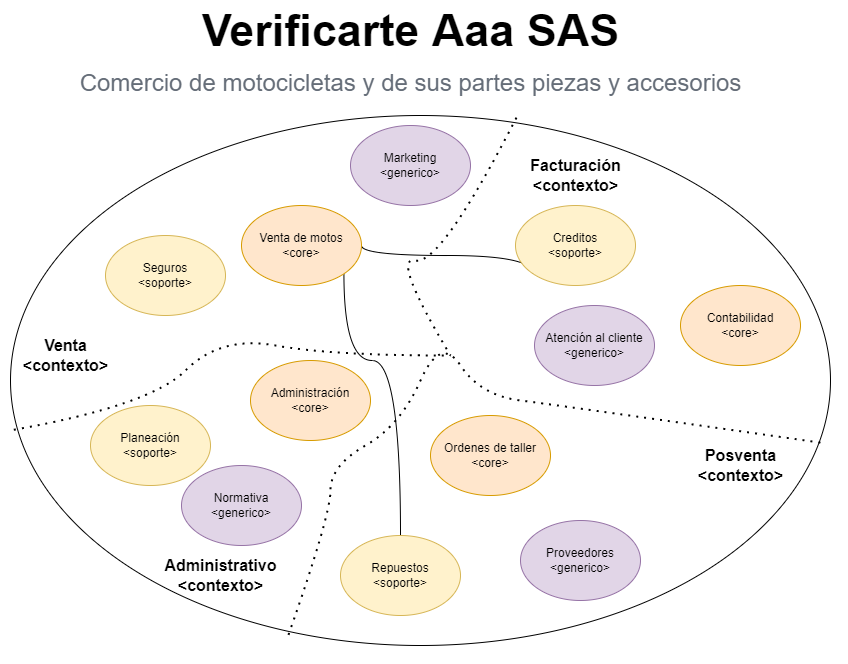
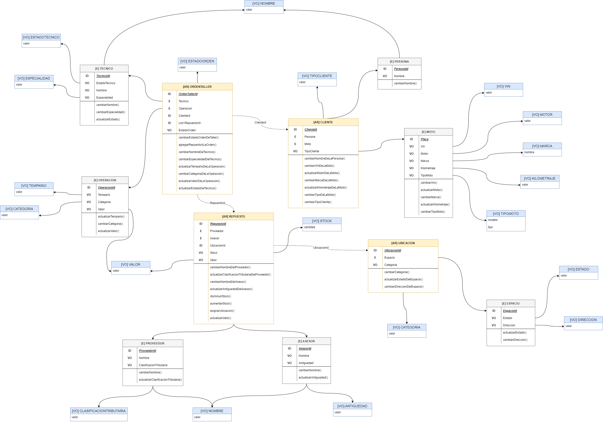
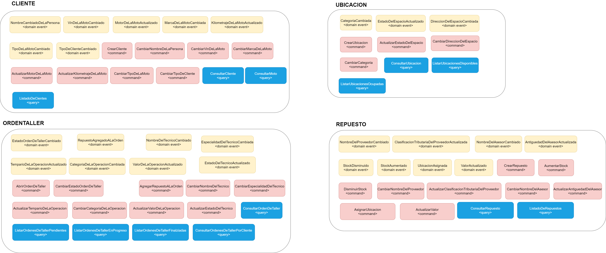

# Reto final

## Taller

Se realiza el reto final con base en un local de motos llamado Verificarte Aaa Sas, este establecimiento cuenta con
distintas areas como lo son principalmente el area de ventas y posventa.

### Artefactos

<ul>
<li>Análisis del problema (big piture y contexto delimitado seleccionado). </li>
<li>Modelo de dominio, con los agregados, comportamientos, entidades y objetos de valor.</li>
<li>Usecase y sus respectivas pruebas de unidad.</li>
</ul>

### Link del diagrama del dominio

https://drive.google.com/file/d/1JJ-ksJXIJq07l416H8qEalgsfizJsOkq/view?usp=sharing

### Autor

<strong>Steven Calderon Guzman<strong>

## Análisis

## Modelo de dominio

## Eventos

